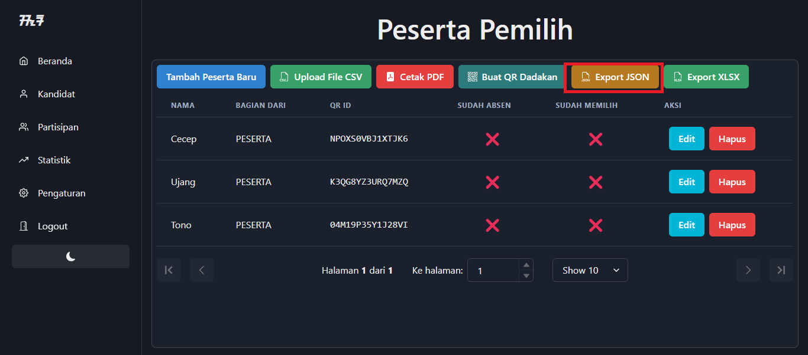
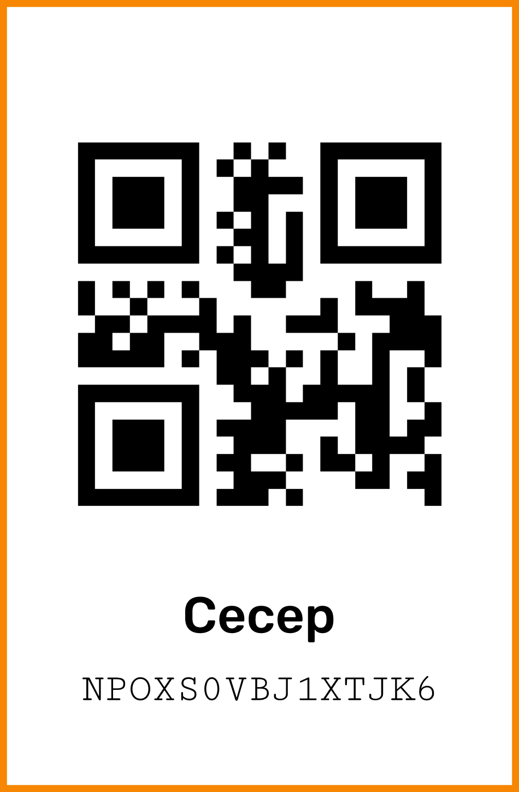

<p align="center">
   
   <h2 align="center">SORA QRCODE WEB</h2>

[](https://github.com/reacto11mecha/sora-qrcode-web/actions/workflows/ci.yml) [](https://github.com/reacto11mecha/sora-qrcode-web/actions/workflows/github-code-scanning/codeql)

</p>

Ini adalah repositori pendukung untuk [sora](https://github.com/reacto11mecha/sora) karena fiturnya yang membutuhkan peserta pemilih untuk mengunduh gambar QR Code yang dibutuhkan untuk bukti bahwa dia memiliki hak pilih.

## Inisialisasi Web

Di bawah ini hal yang yang harus di lakukan agar web ini bisa memberikan hak kepada pemilih yang terdaftar.

### Prerequisites

- Node.js setidaknya versi 18.15.0 atau LTS, kunjungi https://nodejs.org/en
- npm (sudah bawaan Node.js) atau pnpm (kunjungi https://pnpm.io/installation)

### Menggunakan template repositori ini dan clone

Tekan tombol `Use this template` dan pilih [`Create a new repository`](https://github.com/reacto11mecha/sora-qrcode-web/generate), kemudian clone repositori tersebut ke komputer lokal.


Buat repositori sebagai private repo dikarenakan akan terdapat informasi sensitif di dalamnya. Jika sudah yakin, lanjut `Create repository`.


Kurang lebih tampilannya akan terlihat seperti ini setelah menggunakan template, biarkan seperti ini terlebih dahulu.


### Unduh data keseluruhan partisipan

Buka halaman administrator voting, menuju ke halaman partisipan. Disitu akan ditampilkan siapa saja peserta dan beberapa tombol yang dapat digunakan. Klik tombol `Export JSON` untuk mendapatkan data keseluruhan peserta.



Akan muncul prompt unduh, simpan file tersebut untuk nantinya di upload ke repositori yang berada di github.


### Edit file `.gitignore` yang ada di github

Pada awalnya data json yang di dapatkan dari administrator awalnya tidak bisa ditambahkan, oleh karena itu komentari baris terakhir yang ada di file [`.gitignore`](./.gitignore)

```diff
# Komentari dua baris di bawah ini
# ketika sudah di clone
-data/*.json
+# data/*.json
```


Jika sudah, jangan lupa untuk commit perubahan yang sudah dibuat.

### Upload file `data-partisipan.json` ke folder [`data`](./data)

Jika sudah memberi comment pada file `.gitignore`, sekarang waktunya untuk mengupload file yang tadi sudah di download ke repositori.


Ikuti alur dan jangan lupa untuk commit file tersebut.


## Hosting

Untuk hosting, silahkan cek halaman [dokumentasi resmi](https://docs.astro.build/en/guides/deploy/) astro yang dapat host static content.

Untuk penjelasan selanjutnya akan dijelaskan bagaimana cara host di vercel. Vercel adalah salah satu platform gratis yang cocok untuk host static content yang skalanya tidak terlalu besar.

Berikut ini adalah langkah-langkah supaya bisa di host static ke vercel.

1. [Login](https://vercel.com/login) terlebih dahulu ke vercel, disarankan menggunakan github provider karena kemudahan akses repositori

2. Deploy repositori yang nantinya akan di akses oleh pemilih. Tekan tombol import.


3. Akan muncul konfigurasi project, biarkan saja dan tekan tombol deploy.

   

   Tunggu sampai proses deployment selesai.

4. Selamat, sudah berhasil di deploy 🚀

   

Web sudah bisa di akses sekarang, sebagai contoh, website https://contoh-repo-qrcode.vercel.app/ adalah contoh yang dapat peserta akses.

Contoh untuk QR Cecep, bisa akses halaman https://contoh-repo-qrcode.vercel.app/qr/NPOXS0VBJ1XTJK6 dan dibawah ini hasil QR Setelah di download.



List peserta yang lain

- Ujang => https://contoh-repo-qrcode.vercel.app/qr/K3QG8YZ3URQ7MZQ
- Tono => https://contoh-repo-qrcode.vercel.app/qr/04M19P35Y1J28VI

## Lisensi

Repositori ini bernaung dibawah lisensi [GPLv3](LICENSE).
