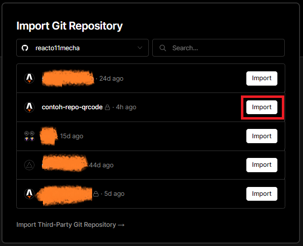
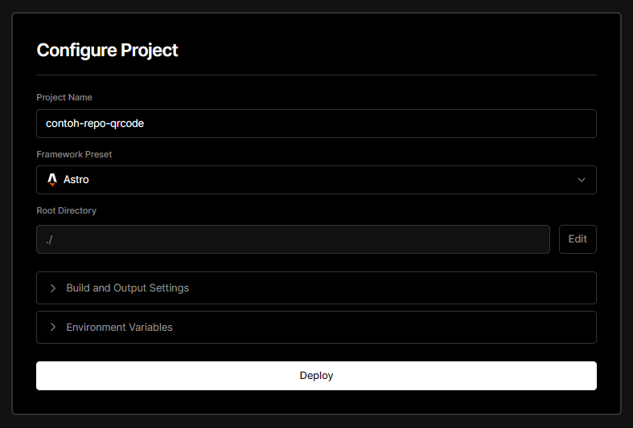
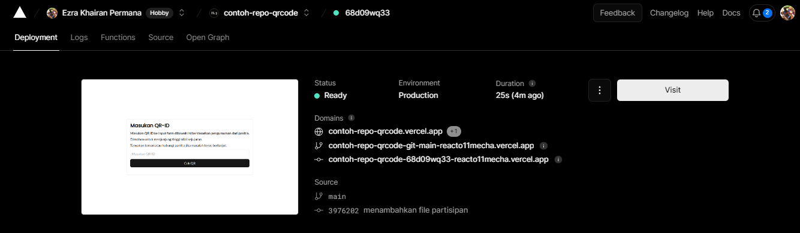

<p align="center">
   
   <h2 align="center">SORA QRCODE WEB</h2>

[](https://github.com/reacto11mecha/sora-qrcode-web/actions/workflows/ci.yml) [](https://github.com/reacto11mecha/sora-qrcode-web/actions/workflows/github-code-scanning/codeql)

</p>

Ini adalah repositori pendukung untuk [sora](https://github.com/reacto11mecha/sora) karena fiturnya yang membutuhkan peserta pemilih untuk mengunduh gambar QR Code yang dibutuhkan untuk bukti bahwa dia memiliki hak pilih.

## Inisialisasi Web

Di bawah ini hal yang yang harus di lakukan agar web ini bisa memberikan hak kepada pemilih yang terdaftar.

### Prerequisites

- Node.js setidaknya versi 18.15.0 atau LTS, kunjungi https://nodejs.org/en
- npm (sudah bawaan Node.js) atau pnpm (kunjungi https://pnpm.io/installation)

### Menggunakan template repositori ini dan clone

Tekan tombol `Use this template` dan pilih [`Create a new repository`](https://github.com/reacto11mecha/sora-qrcode-web/generate), kemudian clone repositori tersebut ke komputer lokal.


Buat repositori sebagai private repo dikarenakan akan terdapat informasi sensitif di dalamnya.


Lalu clone repositori private tersebut ke komputer lokal.


### Menginstall dependensi

Install dependensi yang diperlukan supaya web ini dapat berjalan. Bisa menggunakan pnpm (disarankan) atau menggunakan npm.

```sh
npm install

# atau menggunakan pnpm
pnpm install
```


### Unduh data keseluruhan partisipan

Buka halaman administrator voting, menuju ke halaman partisipan. Disitu akan ditampilkan siapa saja peserta dan beberapa tombol yang dapat digunakan. Klik tombol `Export JSON` untuk mendapatkan data keseluruhan peserta.


Akan muncul prompt unduh, letakan dalam folder `/data` dengan nama `data-partisipan.json` (secara default seperti ini).


### Membuild web

Setelah data sudah siap, saatnya build aplikasi terlebih dahulu supaya dapat di preview di lokal dan tidak terlalu menjadi beban. Jalankan perintah dibawah ini untuk membuild web ini.

```sh
npm build

# atau menggunakan pnpm
pnpm build
```


### Komentari baris yang ada di `.gitignore`

Pada awalnya data json yang di dapatkan dari administrator awalnya tidak bisa di commit beserta gambar yang dihasilkan, oleh karena itu komentari 2 baris terakhir yang ada di file [`.gitignore`](./.gitignore)

```diff
# Komentari dua baris di bawah ini
# ketika sudah di clone
-data/*.json
-public/img/*.png
+# data/*.json
+# public/img/*.png
```


### Push perubahan ke repositori remote

Jangan lupa tambahkan, commit, dan push!

```sh
git add .
git commit -m "menambahkan informasi"
git push
```

## Hosting

Untuk hosting, silahkan cek halaman [dokumentasi resmi](https://docs.astro.build/en/guides/deploy/) astro yang dapat host static content.

Untuk penjelasan selanjutnya akan dijelaskan bagaimana cara host di vercel. Vercel adalah salah satu platform gratis yang cocok untuk host static content yang skalanya tidak terlalu besar.

Berikut ini adalah langkah-langkah supaya bisa di host static ke vercel.

1. [Login](https://vercel.com/login) terlebih dahulu ke vercel, disarankan menggunakan github provider karena kemudahan akses repositori

2. Deploy repositori yang nantinya akan di akses oleh pemilih. Tekan tombol import.



3. Akan muncul konfigurasi project, biarkan saja dan tekan tombol deploy.

   

   Tunggu sampai proses deployment selesai.

4. Selamat, sudah berhasil di deploy 🚀

   

Web sudah bisa di akses sekarang, sebagai contoh, website https://contoh-repo-qrcode.vercel.app/ adalah contoh yang dapat peserta akses.

Contoh untuk QR Cecep, bisa akses halaman https://contoh-repo-qrcode.vercel.app/qr/7CRO9MTNJ3WW41A dan dibawah ini hasil QR Setelah di download.


List peserta yang lain

- Ujang => https://contoh-repo-qrcode.vercel.app/qr/4KV9S7ISMNBRUCI
- Tono => https://contoh-repo-qrcode.vercel.app/qr/98HICZTKNDX1G0P

## Lisensi

Repositori ini bernaung dibawah lisensi [GPLv3](LICENSE).
